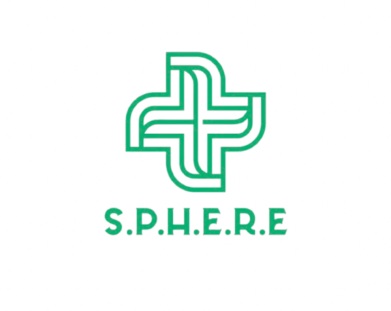

<div align="center">
  
</div>

### **Synchronized Psychiatric & Health Evaluation through Real-time Explainability**
> *An Explainable Multimodal AI Framework for Objective Clinical Decision Support in Psychiatric Evaluation*

[](https://www.python.org/)
[](https://auto.gluon.ai/)
[](https://xgboost.readthedocs.io/)
[](https://shap.readthedocs.io/)
[](https://developer.apple.com/metal/pytorch/)

---

## 📌 Executive Summary

Traditional psychiatric assessments rely heavily on subjective questionnaires (e.g., PHQ-9, GAD-7) and retrospective clinical interviews, which suffer from recall bias, masking, and high inter-clinician variability. 

**S.P.H.E.R.E.** introduces an end-to-end, multi-sensor artificial intelligence framework that integrates **Speech Acoustic Prosody**, **Facial Micro-Expressions**, **Behavioral Device Telemetry**, and **Autonomic Physiological Biomarkers** to perform automated psychiatric triage, quantitative symptom estimation, and game-theoretic clinical auditability.

---

## 🏛️ System Architecture

```
                                  ┌───────────────────────────────┐
                                  │   Multimodal Input Streams   │
                                  └───────────────┬───────────────┘
                     ┌────────────────────────────┼────────────────────────────┐
                     ▼                            ▼                            ▼
        ┌─────────────────────────┐  ┌─────────────────────────┐  ┌─────────────────────────┐
        │  Speech Emotion Stream  │  │ Visual Affect Stream   │  │ Physiological / Telemetry│
        │   1,440 Audio Files     │  │   28,709 Facial Images  │  │  4,000 Patient Records  │
        │ (Wav2Vec 2.0: 1024-d)   │  │   (ViT Tokens: 768-d)   │  │  (18 Numerical Features)│
        └────────────┬────────────┘  └────────────┬────────────┘  └────────────┬────────────┘
                     │                            │                            │
                     └────────────────────────────┼────────────────────────────┘
                                                  ▼
                               ┌─────────────────────────────────────┐
                               │   Semantic Target Alignment Engine  │
                               │  (Clinically Guided Emotion Pairing)│
                               └──────────────────┬──────────────────┘
                                                  ▼
                               ┌─────────────────────────────────────┐
                               │   Dimensionality Reduction (PCA)    │
                               │  Speech: 1024→32  |  Face: 768→32   │
                               │      Total Fused Matrix: 82-d       │
                               └──────────────────┬──────────────────┘
                                                  │
                 ┌────────────────────────────────┴────────────────────────────────┐
                 ▼                                                                 ▼
┌──────────────────────────────────┐                             ┌──────────────────────────────────┐
│   Head B: Severity Regressor     │                             │   Head A: Multi-Layer Stacking   │
│   (MultiOutput XGBoost Trees)    │ ──── 5-Fold OOF Scores ───> │     (AutoGluon Best Quality)     │
│   Depression | Anxiety | Stress  │       (85-d Stacked)        │    4-Class Mental Health Status  │
└──────────────────────────────────┘                             └─────────────────┬────────────────┘
                                                                                   ▼
                                                                 ┌──────────────────────────────────┐
                                                                 │  Objective 3: TreeSHAP Engine    │
                                                                 │   Speech: 43.5% | Face: 32.0%    │
                                                                 │        Tabular: 24.6%            │
                                                                 └──────────────────────────────────┘
```

---

## 🎯 Three Core Objectives & Benchmarks

| Objective | Target | Model Architecture | Metric Achieved |
|---|---|---|---|
| **Head A: Classification** | 4-Class Mental Health Status (`Healthy`, `Mild`, `Moderate`, `Severe`) | AutoGluon 3-Layer Stacked Ensemble (RandomForest, ExtraTrees, LightGBM, CatBoost, XGBoost) | **89.38% Accuracy**<br>**0.9785 ROC-AUC**<br>**0.8418 Macro F1** |
| **Head B: Regression** | Continuous Severity Scores (`Depression 0–34`, `Anxiety 0–24`, `Stress 0–39`) | MultiOutputRegressor (`XGBRegressor` w/ 5-Fold OOF) | **MAE: 6.99**<br>**RMSE: 8.54**<br>**R²: 0.1948** |
| **Objective 3: Explainability** | Transparent Modality Attribution & Feature Importance | Game-Theoretic TreeSHAP Engine | **Speech: 43.45%**<br>**Face: 31.99%**<br>**Physiology: 24.56%** |

---

## 📊 Detailed Quantitative Results

### 1. Classification Performance (Test Set: 800 Samples)
```
                     Precision    Recall / Sens.   F1-Score   Support
  Healthy            0.9935       0.9325           0.9620     326    
  Mild_Stress        0.7843       0.9717           0.8680     247    
  Moderate_Stress    0.9023       0.7811           0.8373     201    
  Severe_Stress      1.0000       0.5385           0.7000     26     

  Overall Accuracy:  89.38%
  Macro F1-Score:    0.8418
  Weighted F1-Score: 0.8931
  Multi-Class ROC:   0.9785
```

> **Clinical Safety Highlight:** Zero `Severe Stress` patients were misclassified as `Healthy`. All misclassifications remain bounded to adjacent severity grades.

---

## 📁 Repository Structure

```bash
S.P.H.E.R.E./
├── GUI/                                      # Full Interactive Web Interface
│   ├── app.py                               # Flask Application Server
│   ├── static/                              # Stylesheets and frontend scripts
│   └── templates/                           # Interactive HTML5 step-by-step diagnostic UI
│
├── autogluon_semantic_stacking_pipeline.py  # Master end-to-end training & SHAP script
├── evaluate_models.py                       # Standalone model evaluation & report generator
├── generate_master_deck.py                  # Programmatic PowerPoint presentation generator
├── extract_speech_embeddings.py             # Wav2Vec 2.0 deep acoustic extractor (1024-d)
├── extract_facial_embeddings.py             # Vision Transformer visual affect extractor (768-d)
│
├── Multimodal_Psychiatric_AI_Deck.pptx      # 9-Slide Publication-Ready Presentation Deck
├── final_aligned_confusion_matrix.png       # Test set confusion matrix visualization
├── modality_attribution_bar_chart_semantic.png # Global TreeSHAP modality attribution chart
├── top_15_shap_features_semantic.png        # Top 15 predictive clinical features
│
├── numerical_data.csv                       # 4,000-sample physiological/behavioral cohort
├── speech_metadata.csv                      # RAVDESS acoustic emotion labels
├── facial_metadata.csv                      # FER2013 visual emotion labels
│
├── head_B_regressor_semantic.joblib         # Serialized MultiOutput severity regressor
├── pca_speech_semantic.joblib               # Fitted 32-d speech PCA transformer
├── pca_facial_semantic.joblib               # Fitted 32-d facial PCA transformer
├── standard_scaler_semantic.joblib          # Fitted numerical feature scaler
└── shap_xgb_proxy_semantic.joblib           # Serialized TreeSHAP proxy model
```

---

## 🚀 Quickstart & Reproduction

### 1. Environment Setup
```bash
# Clone the repository
git clone https://github.com/exhaustmosk/S.P.H.E.R.E..git
cd S.P.H.E.R.E.

# Create and activate Python 3.12 environment
python3.12 -m venv .venv
source .venv/bin/activate

# Install core dependencies
pip install autogluon.tabular xgboost lightgbm shap scikit-learn seaborn matplotlib pandas numpy joblib python-pptx
```

### 2. Run Master Training & Explainability Pipeline
```bash
python autogluon_semantic_stacking_pipeline.py
```

### 3. Generate Evaluation Report & Figures
```bash
python evaluate_models.py
```

### 4. Build Presentation Deck
```bash
python generate_master_deck.py
```

### 5. Launch Interactive Clinical GUI
```bash
cd GUI
pip install -r requirements.txt
python app.py
```

---

## 👥 Research & Engineering Team
* **Akshaj S.** — Lead AI Engineer & Machine Learning Architect
* **Pranshu Verma** — Computer Vision & Deep Learning Specialist


*Department of DSBS — SRM Institute of Science and Technology (SRMIST)*
